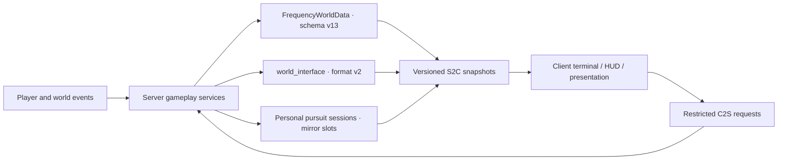

# Architecture and safety boundaries

The authoritative data flow, persistence, protocol and budgets of `1.0.0-rc.5`. Music has its own document ([Background music](audio.md)); trade-offs and rejected alternatives are in [Design notes](design-notes.md#architecture-and-lifecycle).

## Fixed environment

| Item | Value |
| --- | --- |
| Minecraft | 1.21.11 |
| Fabric Loader | 0.19.3 |
| Fabric API | 0.141.4+1.21.11 |
| Java | 21 |
| Mod version | 1.0.0-rc.5 |

## Authoritative data and protocol

| Contract | Version | Constant |
| --- | ---: | --- |
| World / terminal schema | v13 | `PersistenceSchema.CURRENT_VERSION` |
| Terminal main snapshot | v16 | `TerminalSnapshotPayload.CURRENT_PROTOCOL_VERSION` |
| Tool snapshot | v6 | `TerminalToolSnapshotPayload` |
| Navigation | v6 | `TerminalNavigationPayload` |
| Anomaly lifecycle | v3 | `AnomalyStartS2C.PROTOCOL_VERSION` |
| Debug | v6 | `DebugStatusPayload` |
| World Interface state format | v2 | `WorldInterfaceState.FORMAT_VERSION` |
| World Interface network protocol | v3 | `WorldInterfaceProtocol.VERSION` |
| Poem start channel | `world_interface_poem_start_v3` | `PoemStartS2C` |

**Payloads may only append fields at the end.** Decoding is positional; a boolean inserted in the middle silently misaligns every varint after it. The terminal main snapshot's last five steps are all appends: v12 added `onboardingRequired`, v13 added `attentionActive`, v14 added the anomaly backfill list and the first-boot profile (the entry payload gained a trailing `source` in the same version — the two ship together), v15 added the oscilloscope approach reading, v16 added `discoveredFragmentMask` (the records page uses it to withhold a navigation shortcut the server would refuse; the rows themselves stay either way).

**Adding a terminal record key does not require bumping `PersistenceSchema.CURRENT_VERSION`.** Backfill is driven by key presence in `TerminalData.migrateRecord` (`if (!record.contains(key))`). Schema steps are reserved for changes that alter the meaning or structure of existing fields.

**Every versioned payload must first pass dimension, player, holding, session and permission checks.** Old clients may only take an explicit compatibility branch, and an unknown format is **safely rejected** rather than guessed at.

**`world_interface_blast_v1` is a pure presentation channel**: it carries one blast's position, radius and tier (`LIGHT/MEDIUM/HEAVY/CATACLYSM`), is never persisted, is never acknowledged, and the cost of a dropped packet is one missing camera shake — so it has **no version step**. The rule is "**derive the beats, notify the blasts**". The same channel carries per-source throttling (`WorldInterfaceBlastService`, 6 ticks by default), which doubles as protection for the client mixer.

## Station Zero

Split between `ZeroStationLayout` (shape) and `ZeroStationService` (siting and construction).

- **Siting happens once**: on first server start, candidates are taken on a 4-block grid within ±12 blocks of the original spawn, sampling 9 columns of each candidate footprint; any sample on liquid or with an unreadable height is discarded, and the rest are ranked by "height range × 8 + distance from original spawn".
- **Chunks must be fetched before sampling**: `Level.getHeight()` loads nothing — with the chunk unloaded it does not error, it simply returns the world bottom.
- **The layout is a pure function of the station centre**: construction advances in batches of 64 placements per tick and resumes from a persisted cursor after a restart, so the plan must be byte-for-byte reproducible — the layout reads no world state and uses no random source; all weathering variation comes from a hash of local coordinates.
- **The order carries meaning**: the floor layer is written first (a player who joins mid-build always has somewhere to stand) → the whole envelope is cleared (including two layers above the roof, so no tree trunk is left hanging) → foundation, walls, roof, mast → beds and doors, as double blocks, last and in pairs.
- **The station lights itself**: 8+ light sources are placed already lit, and neither the interior nor the roof spawns hostiles naturally.
- **The station holds no loot**: an empty terminal rack, an empty lectern and one empty barrel are narrative, not starting resources.
- **The join that issues the terminal also sends one `terminal_auto_open`**, and the device comes up by itself. It hangs off the branch where `issueTerminalIfNeeded` returned true and therefore shares the grant's ledger: once per player per save, never on a rejoin. The payload is empty because **the server is not the one deciding** — it says only "this may open now", and `TerminalAutoOpenPolicy` decides when and answers with the same `TerminalOpenPayload` a right-click sends, through the server's existing validation. A dropped packet costs one convenience on one join, so it carries **no version step and no acknowledgement**. See [Terminal UI and handheld form](terminal-ui.md#the-terminal-opens-itself-once).

## Terminal and mainline

- Player pages are fixed at `HOME / TOOLS / RECORDS / FILES`; wire mode keeps `SIGNAL / FILES` for protocol compatibility. Appearance contracts are in [Terminal interface](terminal-ui.md).
- **Page changes, presses and scrolling only affect drawing**: the page field switches the instant of the click, and hit testing never lags the animation.
- Six tools: shelter, minerals, portal, weather, navigation, stronghold.
- The **weather tool**'s sky instrument samples the sky the client actually renders, maintaining zenith, horizon, magnitude and celestial-phase channels; only `red_horizon` and `metric_drift` drive that page's progressive fault presentation.
- **The mineral probe reads terrain rather than rolling dice**: the server sweeps unlocked ores from near to far and takes the rarest within range; each ore's reach is in `MineralSurveyPolicy.probeRadius`, and once an ore is found the scan immediately narrows to "rarer than this one".
- The **near-field receiver** is authorised to tune and lock by "the player has reached the candidate site" directly, independent of which tool detail is open; correct tuning must hold for 20 ticks, and the tool snapshot syncs progress every 2 ticks while locking.
- File unlocks, the anomaly catalogue and mainline objectives are all snapshotted by the server; **the UI never derives authoritative completion state**.
- `FILES`, `RECORDS`, tool detail and navigation candidates each keep their own scroll/overflow state; a pursuit force-opening RECORDS does not overwrite the page the player remembered.
- **The `RECORDS` unread count only counts entries the page will actually list** (`TerminalRecordPolicy.listedInRecords`).
- Navigation requires the server to have recorded three real Eye of Ender throws, so a client cannot forge a route.

### Fragment leads

**Leads come from exploration, not from a computation at world start.** The server runs at most **one player's** lead scan every 10 ticks:

| Item | Rule |
|---|---|
| Scan interval | 20–45 s while the player has no unresolved lead; 1–3 min once they do |
| Data source | Real `StructureStart`s in **already-loaded chunks** only; **never generates a new chunk** |
| Recorded position | The **true centre** of that `StructureStart`'s bounding box, with a true Y — not `getLocatePos` |
| Structure pool | **A preference, not a requirement**: a scan that finds nothing in a fragment's own four types costs it a point of patience; once `POOL_PATIENCE_SCANS` runs out, any nearest structure can carry it. Counted per fragment and persisted |
| "Arrived" test | Two conditions, both observable by the player: standing inside a `StructurePiece` of that candidate type, **and** the structure being within `FragmentSignalPolicy.SIGNAL_RANGE_BLOCKS` (320, horizontal) of the marked position |
| Navigable or not | `FragmentInvestigationPolicy.offered`: band stage > 0, and either an unresolved lead exists or one is already selected. **The same condition under which the records page files a lead** — no further mainline gate |

**If the records page filed a lead, navigation has to be able to go there.** The records line, its trailing `[open navigation]` shortcut and the navigator's `[optional file investigation]` option all read one answer (`TerminalToolService.unstableSignalAvailable` → `FragmentInvestigationService.investigationOffered`). The three used to decide separately: a lead is filed on day one, while navigation additionally required the Nether, so the terminal named a place it refused to route to and the shortcut did nothing when pressed. Nothing but the lead being resolved may withdraw that entry point.

The old start-of-game pre-allocation (searching 256 chunks from Station Zero with `findNearestMapStructure`) is retired entirely.

### Files

- The four damaged files' **discovery state belongs to the world**; **reading state and full-journal access belong to the terminal's owner**.
- Roughly 50% of each file's fragments render in a scattered, explicitly non-garbled style; discovery count controls only the journal title's recovery, reading count only the 0–100% unlock.
- **The device manual pages are outside this investigation.** Four pages are issued as their tools unlock and live in the same file store, but they are not in `HiddenFilePolicy.FILE_IDS`: they do not move the discovery count, the read percentage, or the journal's unlock condition. The roster and the issuing rule are in `narrative/DeviceManualPolicy` (a pure class).
- Each player unlocks the full journal by reading all four themselves; unlocking **generates no extra files, blocks or world structures**.
- After first assignment, one **idempotent rescue assignment** runs over any file still empty, so legacy or edge-case data cannot leave a permanently blank file.
- File notices use a separate server-side unread counter, cleared by visiting `FILES`; it does not write per-file reading state.

## Anomaly and pursuit boundaries

The currently triggerable catalogue holds **18 entries** across tiers 1–5, two of which are low-intensity "sustained" anomalies lasting minutes (`silent_world`, `metric_drift`). The server owns personal tier, the sliding candidate pool, last-three exclusion, new-content weighting, cooldowns and success adjudication.

`surface_fracture`, `temporal_drift` and `luminance_fault` were merged into `phantom_echo`, `metric_drift` and `local_rule_collapse` and are **read-only historical ids**: they keep their original position in `AnomalyCatalog.MASK_ORDER` (that list *is* the bit order of `ANOMALY_SEEN_MASK`).

Personal pursuits use three layers of server state:

| State | Determined by |
|---|---|
| `allowedForm` | The highest permission granted by the mainline and activity proof |
| `actualForm` | The number of resolved pursuits; advances at most one step per success |
| `pendingChase` | Holds only the next one; never accumulates cross-threshold debt |

Full rules in [Anomalies, terminal forms and personal pursuits](anomalies-and-pursuits.md).

### Mirror dimensions and streamed snapshots

The Overworld, Nether and End each pre-register two mirror dimensions, but **only one pursuit runs server-wide at a time** (`PursuitSlotManager.MAX_ACTIVE_PURSUITS = 1`). All six mirrors **stay registered**, because recovery must be able to find a player left in any of them by an old save.

The entry transaction first saves the source dimension, position, rotation and recovery state, then copies a sanitised 5×5-chunk, ±48-block snapshot at 8192 blocks per session per tick. The blackout waits for the 7×7 chunks around the player in the target dimension and 8 consecutive stable ticks, up to 200 ticks.

Mirror worlds are uniformly excluded from real progress entry points — mainline, navigation, anomalies, the finale and world decay. Breaking mirror blocks yields no drops; simple placements write a persistent refund ledger, and resolution, disconnect and restart recovery all use the same idempotent entry point.

### The unrendered layer and the private-dimension test

The unrendered layer (`unrendered` package) is the second private dimension, and architecturally it is the **inverse** of the mirror: the mirror is a **streamed copy** of the real world; the unrendered layer is an infinite plane **computed** by a `ChunkGenerator`, copying nothing and storing nothing.

**One dimension, isolation by distance**: the 16 slot entry points are 1.5 million blocks apart, beyond the reach of any chunk loading, entity tracking, sound or map — and because the maze hashes on coordinates, two players are not even in the same room.

The session transaction mirrors the pursuit's: the return address is written into the player's record in `FrequencyWorldData` **before** the teleport, and disconnect, death, admin teleport and server stop each have an idempotent cleanup path.

The exit is a 15×15 region of collisionless blocks (`UNRENDERED_FALSE_WALL` / `UNRENDERED_FALSE_FLOOR`, `noCollision().forceSolidOn()`). **`forceSolidOn()` is not optional** — without it, a collisionless block counts as non-solid and both occlusion and lighting leak.

> **`PrivateDimensions.isPrivate` is the only place the question "the player is not in the world they live in" may be asked.** Seventeen environment systems previously each checked `PursuitDimensions.isMirror` — every one correct while the mirror was the only case, and every one silently wrong once a second private dimension existed, with **no failing test and no log line**. `MultiplayerIsolationContractTest` guards this from the source.

## The World Interface subsystem

Eight mutually constraining parts (numbers in [The World Interface finale](world-interface.md)):

1. **Altar transaction**: the roster is built one at a time from people who actually hand over a terminal, capped at 8; the first terminal into the core starts a 3-minute window (`ritual_deadline_tick`, persisted), withdrawal is allowed inside it, expiry refunds everything, and the atomic commit is triggered explicitly by a player who has already handed one over.
2. **One-way state machine**: `UNPREPARED` is the not-yet-prepared sentinel; the real flow covers arena ready, waiting, summoning, three combat forms, success/failure resolution, portal and complete.
3. **Combat scheduling**: five true target locks and two unavoidable deprivations use different telegraphs, and **only confiscated weapons enter the recovery ledger**.
4. **Arena policy**: the native End main island, generating only the ground-hugging altar, 20 inert gateways and 10 stability anchors; living anchors project an 8-block stability zone from their authoritative position, uniformly constraining player damage reduction, server terrain edits and client erosion presentation.
5. **Stability anchor entities**: 10 slots carried by `StabilityAnchorEntity`, with unchanged indices and deterministic UUIDs; the truth about survival lives only in `WorldInterfaceState` (the disk key is still `crystal_uuid`, the Java-side meaning is `anchorEntityUuid`).
6. **Ending bridge**: resolution opens a 3×3 native return exit through vanilla's End Poem / respawn path; the success payload carries the final broken-anchor count to select among three poems.

7. **Presentation primitives**: `WorldInterfaceVfx` (common, package-private surface aside) provides shapes only - rings, rings around an arbitrary axis, outward shock rings, helices, jagged arcs, shells, columns and spokes. No state, no randomness (every phase and jitter term comes from the world clock or from a seed the caller passes), no authority; safe to call on any tick and safe to lose entirely. Particles go out through `ArenaParticles` with the 512-block limiter override. **This class is deliberately exempt from the particle budget** (the user asked for it on 2026-08-29); throttling is left to the call sites.
8. **Drop beacons**: `WorldInterfaceDropBeaconService` (common) stands a column of light over the item entities the hotbar purge throws, registering its own `END_SERVER_TICK` and `SERVER_STOPPED` and initialising before `WorldInterfaceAttackService`. Purely transient: never persisted, capped at 256 marks, and a mark is dropped the moment its entity is gone.

**The server adjudicates the collapse timeout before the fatal blow each tick**, so a same-tick edge resolves as failure. The collapse pauses when every frozen member is offline.

**The rig is shared and hitboxes bind to it**: `WorldInterfaceClips` (common) holds the single copy of thirty-seven keyframe clips, `WorldInterfaceRig` (common) evaluates them plus the procedural layers; the server places hitboxes from that evaluation and the client drives `ModelPart` from **the same one**.

Once the state machine enters success or failure resolution, ordinary anomalies, gap pressure, decay and pursuits are **permanently closed** and do not reopen after `COMPLETE`.

## Client lifecycle

- **v4 first-run flow**: on the same terminal, the audio calibration page (master volume slider + preview + Next) comes first, then the safety notice. The acknowledgement version is stored separately and does not occupy `ModConfig`; the volume itself writes back to `ModConfig`'s `meta.peakVolume` — the only setting allowed to rewrite the in-process config at runtime (`RuntimeServices.updateConfig`).
- **Alpha presentation** is managed as Programmer Art → Golden Days Base → Golden Days Alpha, with a one-off legacy loading screen and "Minecraft 1.0.0" strings; after the corruption completes, the window title and version stamp are that same string, identical in singleplayer and multiplayer and with no world suffix.
- Alpha's "medium is breaking" layer is a **real post-process**: `ScreenFilterDriver` runs `analog_signal.fsh` (the still variant) over the whole frame before `blitToScreen`.
- The **three filter languages** (analog signal / digital corruption / dispersion) and the **two post-process slots** are fully specified in [Anomalies and pursuits](anomalies-and-pursuits.md#three-filter-languages).
- **Rain and thunder in the End are pure client presentation**: the client writes its own `ClientLevel`'s rain level, and `WeatherEffectRendererEndRainMixin` widens that column's precipitation from `NONE` to `RAIN`; thunder is scheduled as a pure function of the world clock. **Not one byte of `ServerLevelData` is written.**
- **View distance** is locked to 6/12/16 for Overworld/Nether/End before the ending (12 elsewhere); it unlocks permanently to 16 only after the success poem is confirmed and the player really returns to the Overworld.
- **The view-distance lock and the Alpha downgrade only apply in worlds this mod drives.** Both change things that belong to the *player* rather than to the *save* (render distance in `options.txt`, global resource-pack selection, the window title), so they must first answer "is this world mine?". The test is `ClientPlayNetworking.canSend(TerminalOpenPayload.TYPE)`, adding no protocol; `ModWorldPresence` is the only place that asks. On leaving a world, render distance is handed back to the player's own value (captured once, not recaptured across dimensions).
- Both endings write a local ending lock. **F8 opens the recovery confirmation only when a lock exists**; with no lock it is not a meta toggle.
- After recovery, only a `.thefourthfrequency-corrupted` lossless marker isolates the exactly-matching local save; **vanilla world data is never modified**.
- Losers each see missing textures on their own client; a LAN host keeps the server running, and guests and the server world are unaffected. **Both endings hand quitting back to the pause menu.**

## Multiplayer boundaries

The same rule can be written any way in singleplayer and only one way in a shared world. Below is the line between "ask per player" and "ask per world" — **every row has been on the wrong side at some point**.

| Fact | Owner | Test |
| --- | --- | --- |
| Mainline milestones, anomaly tier, terminal records, texture decay | Per player | Their own terminal record |
| Full texture decay during combat | Per player | `FinaleRuntimePolicy.insideRunningEncounter`: on the roster, or standing in the End |
| Combat broadcasts (fight start, an anchor falling, the dragon's lines, form changes) | Encounter | `encounterRecipients`: roster ∪ the End |
| Being selected as an attack target | Encounter | `arenaParticipants`: the frozen roster |
| **Discovery** of the damaged files, Station Zero, the World Interface state machine | World | `FrequencyWorldData` / `world_interface` |
| **Reading** the damaged files and full-journal access | Per player | Their own terminal record |

- **Shared anomalies only land when nobody can really see**: the test is no other non-spectator player within 32 blocks, and it **does not ask whether they have a terminal**.
- **HIM's three gates**: **never** spawns inside a private mirror (including the debug entry); goes permanently silent with the other environment systems after the finale resolves; never triggers for a player with no terminal record.
- **Death does not scatter escrowed items on the ground**: the rejection for bound terminals and legacy confiscation placeholder barriers is injected at `LivingEntity#drop(ItemStack, boolean, boolean)` — the layer `Inventory#dropAll` and `EntityEquipment#dropAll` actually reach. Custody no longer places a barrier at all (the slot is simply emptied, and the stack returns to a different slot); this path exists for barriers already sitting in older saves.
- **Not every online player has a terminal record**: after the finale resolves, `ZeroStationService.issueTerminalIfNeeded` deliberately does not write the grant ledger, so a newly joining player is one this mod holds no state for at all. Every per-player writer must tolerate that before writing.

### Delayed relay between terminals

After two bound terminals spend a full minute within 32 blocks of each other, the receiver gets one record line from the other **4–11 minutes later**. Rules in `terminal/TerminalRelayPolicy` (pure class), runtime in `TerminalRelayService`.

Four hard boundaries:

| Boundary | Meaning |
|---|---|
| **Never attributed** | The other party's identity is used only as a capture seed and is never stored |
| **Never actionable** | Only "the other terminal recorded something of this shape" — never coordinates, targets or leads |
| **Never about pursuits** | The private correction layer is the one place the player is genuinely alone |
| **Consent both ways** | Sending requires an explicit "yes" on questionnaire question 5; unanswered never sends. Receiving defaults on, but an explicit "no" is honoured |

The pending queue lives in **the receiver's own terminal record**, so the relay is isolated per player by construction and migrates with the record. Mirror dimensions, active pursuits and the resolved finale never participate.

Tier 5 adds a third form, `SELF_ECHO`: it returns a line the receiver **themselves** recorded long ago, as if it came from elsewhere — it passes nothing between two terminals, so there is no boundary to cross.

## Configuration surface

`ModConfig` keeps only the ten entries production actually reads:

| Path | Default | Purpose |
| --- | ---: | --- |
| `meta.enabled` | `true` | Master switch for meta presentation |
| `meta.peakVolume` | `0.8` | Mod master volume: every authorised cue and this mod's music multiply by it; the first-run calibration page writes exactly this |
| `meta.bedVolume` | `1.0` | Separate attenuation for the continuous signal bed, applied on top of `peakVolume` |
| `meta.forcedEviction` | `true` | Whether the World Interface may really disconnect a player |
| `pacing.developerAcceleration` | `false` | Development pacing acceleration |
| `presentation.cameraShake` | `1.0` | Camera shake strength — a continuous 0–1 value, not a switch |
| `presentation.hitStop` | `true` | Hit stop |
| `presentation.impactFlash` | `true` | Impact flash |
| `clientState.alphaDowngradeComplete` | `false` | One-off Alpha downgrade state |
| `clientState.viewDistanceUnlocked` | `false` | View distance unlocked by the success ending |
| `clientState.debugHudGroups` | absent means all four on | Bitmask of the debug HUD groups to draw; read only while personal debug is enabled |

> **The six later entries are all boxed types** (`Double` / `Boolean`). Gson fills a missing primitive with `0` / `false`, so shipping `double` / `boolean` directly would silently hand every player whose config predates the field a muted, switched-off presentation.

## Budgets and protection

| Subsystem | Current budget / limit |
| --- | --- |
| World Interface permanent scars | 8192 blocks total; 32 blocks per tick |
| Laser arena edits | 90-tick lock + 40-tick sweep; during the sweep, one radius-2, cap-6 scar every 2 ticks |
| Dragon-breath bolt impact | Radius 3 + form, cap 14 + form×10; flight cap 120 ticks at 0.95 blocks/tick; breath cloud 220 ticks |
| Sky lance impact | Main crater radius 7, cap 90; outer erosion radius 9, cap 34 |
| Tendril lash | After a 45-tick rear-up, once every 45 ticks, 3 times; radius 3, cap 12 each |
| Collapse timer | 12000 ticks; paused when everyone is offline |
| Action interval | Phase 1 150–200 ticks; phase 2 75–105; phase 3 35–60. Multiplied by the roster density factor `1 / (1 + 0.18 × (players − 1))` (floor 0.45), never below 20 ticks |
| Phase-3 salvo | Every 40 ticks; concurrency cap `3 + (players − 1) / 2` |
| Exclusive-control protection | 600 ticks per target; exclusive controls are mutually exclusive (the salvo channel does not participate) |
| Resource scanning | 1024 per player; at most 4 players, 4096 total |
| Navigation work | 4 cells per tick |
| Private pursuit concurrency | At most 1 server-wide |
| Pursuit initial snapshot | 5×5 chunks; ±48 blocks vertically |
| Pursuit streaming | 8192 blocks per session per tick; no fixed horizontal boundary |
| Fragment lead scanning | At most one player every 10 ticks; loaded chunks only |

Arena protection covers bedrock, the obsidian pillars, End return structures, block entities, key mod blocks, `#thefourthfrequency:world_interface_immune` and compatibility immunity tags.

Safe mode `-Dthefourthfrequency.safeMode=true` is only for recovering an interrupted ending transaction.
