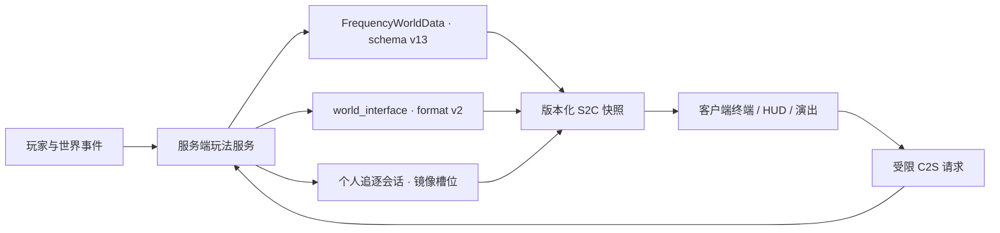

# 架构与安全边界

`1.0.0-rc.1` 的权威数据流、持久化、协议与预算。配乐单独见[背景音乐](audio.md)，取舍与被否决的方案见[设计札记](design-notes.md#架构与生命周期)。

## 固定环境

| 项 | 值 |
| --- | --- |
| Minecraft | 1.21.11 |
| Fabric Loader | 0.19.3 |
| Fabric API | 0.141.4+1.21.11 |
| Java | 21 |
| MOD 版本 | 1.0.0-rc.1 |

## 权威数据与协议

| 契约 | 版本 | 常量 |
| --- | ---: | --- |
| 世界/终端 schema | v13 | `PersistenceSchema.CURRENT_VERSION` |
| 终端主快照 | v16 | `TerminalSnapshotPayload.CURRENT_PROTOCOL_VERSION` |
| 工具快照 | v6 | `TerminalToolSnapshotPayload` |
| 导航 | v6 | `TerminalNavigationPayload` |
| 异象生命周期 | v3 | `AnomalyStartS2C.PROTOCOL_VERSION` |
| Debug | v6 | `DebugStatusPayload` |
| 世界接口状态格式 | v2 | `WorldInterfaceState.FORMAT_VERSION` |
| 世界接口网络协议 | v3 | `WorldInterfaceProtocol.VERSION` |
| 诗篇开始通道 | `world_interface_poem_start_v3` | `PoemStartS2C` |

**载荷只能在末尾追加字段。** 解码按位置进行，中间插一个布尔会让其后每个 varint 静默错位。终端主快照最近五级都是追加：v12 加 `onboardingRequired`，v13 加 `attentionActive`，v14 加异象回填清单与首启建档（条目载荷同版追加尾部 `source`，两者绑定发布），v15 加示波器接近读数，v16 加 `discoveredFragmentMask`（记录页据此收起服务端本就会拒绝的导航快捷入口；行本身照常保留）。

**新增一个终端记录键不需要抬 `PersistenceSchema.CURRENT_VERSION`。** 回填由 `TerminalData.migrateRecord` 按键存在性驱动（`if (!record.contains(key))`）。schema 台阶留给真正改变已有字段含义或结构的改动。

**所有版本化载荷都必须先完成维度、玩家、持有物、会话和权限校验。** 旧客户端只能走明确兼容分支，未知格式**安全拒绝**而不是猜测字段含义。

**`world_interface_blast_v1` 是纯呈现通道**：只带一次爆炸的坐标、半径与档位（`LIGHT/MEDIUM/HEAVY/CATACLYSM`），不持久化、不确认，丢一个包的代价就是少一次相机抖动，因此**没有版本号台阶**。规则是「**节拍靠推导，爆炸靠通知**」。同一通道上有每源节流（`WorldInterfaceBlastService`，默认 6 Tick），它同时是客户端混音器的保护。

## 零号站

由 `ZeroStationLayout`（形状）与 `ZeroStationService`（选址与建造）分工。

- **选址只做一次**：服务器首次启动时在原始出生点 ±12 格内按 4 格网格取候选，采样每个候选足迹的 9 根柱子；任一采样落在液面上或读不出高度直接淘汰，其余按「高度极差 × 8 + 离原出生点距离」排序。
- **采样前必须先取区块**：`Level.getHeight()` 不加载任何东西——区块未加载时它不报错，而是直接返回世界底部高度。
- **布局是站心的纯函数**：建造按每 Tick 64 个放置分批推进，中途关服从持久化游标续建，因此计划必须能被逐字节重新生成——布局不读世界、不用随机源，全部风化差异来自局部坐标的哈希。
- **顺序有语义**：地板层最先写入（建造途中连入也总有落脚点）→ 清空整个包络（含屋顶以上两层，避免树干悬空）→ 地基、墙体、屋顶、桅杆 → 床与门这类双方块最后成对写入。
- **站体自带照明**：8 处以上光源在放置时即为点亮状态，室内与屋顶都不自然生成敌对生物。
- **站体不放战利品**：空的终端架、空讲台和一只空木桶属于叙事，不属于开局资源。
- **发终端的那一次进服会顺带发一条 `terminal_auto_open`**，终端随后自己升起来。它只挂在 `issueTerminalIfNeeded` 返回真的那一支上，因此与发放共用同一本账：每个玩家每个存档一次，重进不再触发。载荷本身是空的，**决定权不在服务端**——它只是把「可以开了」告诉客户端，由 `TerminalAutoOpenPolicy` 决定什么时候、并用右键那条 `TerminalOpenPayload` 回来，走服务端原本的校验。掉一个包的代价是那一次进服少一个便利，所以**没有版本号台阶、没有确认**。详见[终端界面与手持形态](terminal-ui.md#终端会自己打开一次)。

## 终端与主线

- 玩家页面固定 `HOME / TOOLS / RECORDS / FILES`；wire 模式保留 `SIGNAL / FILES` 以兼容协议。外观契约见[终端界面与手持形态](terminal-ui.md)。
- **换页、按下与滚动只影响绘制**：页面字段在点击那一刻就已切换，命中判定从不落后于动画。
- 六个工具：住所、矿物、传送门、天气、导航、要塞。
- **天气工具**的天空仪表直接采样客户端实际渲染的天空，维护天顶、地平线、星等、天体相位四个通道；只有 `red_horizon` 与 `metric_drift` 驱动该页的渐进故障演出。
- **矿物探针是「读取地形」而非「掷骰给结果」**：服务端由近及远扫一遍已解锁矿种，取范围内最稀有的一个；每种矿的听程写在 `MineralSurveyPolicy.probeRadius`，一旦找到某矿，扫描立刻收缩到「比它更稀有者」。
- **近场接收器**由「玩家已到达候选地点」直接授权调频与锁定，不依赖当前打开的工具详情；正确调谐需稳定保持 20 Tick，锁定期间工具快照每 2 Tick 同步进度。
- 文件解锁、异象目录和主线目标均由服务端生成快照；**UI 不自行推导权威完成状态**。
- `FILES`、`RECORDS`、工具详情与导航候选各自维护滚动/溢出状态；追逐强制打开记录页也不覆盖玩家记住的常规页面。
- **`RECORDS` 未读数只统计记录页真的会列出的条目**（`TerminalRecordPolicy.listedInRecords`）。
- 导航要求服务端记录三次真实末影之眼投掷，避免客户端伪造路线。

### 碎片线索

**线索来自探索，不是开局算好的。** 服务端每 10 Tick 至多给**一名**玩家做一次线索扫描：

| 项 | 规则 |
|---|---|
| 扫描间隔 | 尚无未解决线索时 20–45 秒；已有线索后 1–3 分钟 |
| 数据来源 | 只读**已加载区块**里的真实 `StructureStart`，**绝不生成新区块** |
| 记录坐标 | 该 `StructureStart` 包围盒的**真实中心**（带真实 Y），不是 `getLocatePos` |
| 结构池 | **偏好而非硬性要求**：一次扫描没在某碎片自己的四类里找到东西就扣一点耐心，`POOL_PATIENCE_SCANS` 用完后最近的任意结构都能带它。计数按碎片分别记、写进存档 |
| 「已到达」判据 | 两条，且都是玩家能观察到的：站在该候选结构类型的某个 `StructurePiece` 内，**且**结构离标记坐标不超过 `FragmentSignalPolicy.SIGNAL_RANGE_BLOCKS`（320 格，水平） |
| 是否可导航 | `FragmentInvestigationPolicy.offered`：波段阶段 > 0，且还有未解决线索或已选中一条。**与记录页登记线索的条件一致**，没有额外主线门槛 |

**记录页登记了线索，导航就必须能去。** 记录行、行尾的 `[打开导航]` 与导航页的 `[可选文件调查]` 全部读同一个答案（`TerminalToolService.unstableSignalAvailable` → `FragmentInvestigationService.investigationOffered`）。三者曾各自判断：线索第一天就写进记录，导航却要求先进过下界，于是终端点名了一个它拒绝带你去的地点，按钮按下去没有任何反应。线索被解决之外的任何理由都不得撤回这个入口。

旧的开局预分配（从零号站用 `findNearestMapStructure` 搜 256 区块）已整体退役。

### 文件

- 四份破损文件的**发现状态属于世界**；**阅读状态与完整日记权限属于终端主人**。
- 每份文件约 50% 的片段以零散、显式非乱码样式显示；发现数只控制日记标题恢复，阅读数只控制 0%–100% 解锁进度。
- 每位玩家独立读完四份后解锁完整日记；解锁**不生成额外文件、方块或世界结构**。
- **设备手册残页不属于这套投资。** 四页手册随对应工具解锁发放，走同一个文件存储，但不进 `HiddenFilePolicy.FILE_IDS`：它们不改发现数、不改阅读百分比、不参与完整日记的解锁条件。名单与发放规则在 `narrative/DeviceManualPolicy`（纯类）。
- 首次分配后会对仍为空的文件执行一次**幂等救援分配**，避免存量或边界数据留下永久空白文件。
- 文件通知使用独立的服务端未读计数，访问 `FILES` 页即清除；它不写入逐篇阅读状态。

## 异象与个人追逐边界

当前可触发目录 **18 项**、1–5 阶段，其中 2 项是持续数分钟的低强度持续型（`silent_world`、`metric_drift`）。服务器决定个人阶段、滑动候选池、最近三次排除、新内容权重、冷却与成功判定。

`surface_fracture`、`temporal_drift`、`luminance_fault` 已并入 `phantom_echo`、`metric_drift`、`local_rule_collapse`，属**只读历史 ID**：保留在 `AnomalyCatalog.MASK_ORDER` 的原始位置（该列表就是 `ANOMALY_SEEN_MASK` 的位序）。

个人追逐使用三层服务端状态：

| 状态 | 由什么决定 |
|---|---|
| `allowedForm` | 主线与活动证明给出的最高许可 |
| `actualForm` | 已解决追逐数，每次成功最多前进一级 |
| `pendingChase` | 只保存下一场，不积累跨门槛追逐债务 |

完整规则见[异象、终端形态与个人追逐](anomalies-and-pursuits.md)。

### 镜像维度与流式快照

主世界、下界和末地各预注册两个镜像维度，但**全服同一时刻只允许一场追逐**（`PursuitSlotManager.MAX_ACTIVE_PURSUITS = 1`）。六个镜像维度**仍全部保持注册**，因为恢复必须能找到被旧存档留在其中任意一个里的玩家。

入场事务先保存来源维度、坐标、朝向和恢复状态，再以每会话每 Tick 8192 方块的预算复制 5×5 区块、垂直 ±48 格的净化快照。黑屏等待目标维度中玩家周围 7×7 区块就绪并连续稳定 8 Tick，最多等 200 Tick。

镜像世界统一从主线、导航、异象、终局和世界衰败等真实进度入口排除。破坏镜像方块不获得掉落；简单放置写入持久退款账本，结算、断线和重启恢复使用同一幂等入口。

### 未渲染层与私人维度判据

未渲染层（`unrendered` 包）是第二个私人维度，架构上与镜像**正好相反**：镜像是真实世界的**流式副本**，未渲染层是一个 `ChunkGenerator` **算出来**的无限平面，不复制任何东西、不保存任何东西。

**只有一个维度，隔离靠距离**：16 个槽位入口点相距 150 万格，超出任何区块加载、实体追踪、声音与地图的作用范围；加上迷宫按坐标哈希，两名玩家甚至不在同一间房。

会话事务与镜像同构：返回地址在**传送之前**写进 `FrequencyWorldData` 的玩家记录；断线、死亡、管理员传送、服务器停止各有幂等收尾路径。

出口是一片 15×15 的无碰撞方块区域（`UNRENDERED_FALSE_WALL` / `UNRENDERED_FALSE_FLOOR`，`noCollision().forceSolidOn()`）。**`forceSolidOn()` 不是可选项**——缺了它无碰撞方块会被当成非实心，遮挡和光照都会漏。

> **`PrivateDimensions.isPrivate` 是「玩家不在他所居住的世界里」这个问题的唯一提问点。** 此前十七处环境系统各自检查 `PursuitDimensions.isMirror`——每一处在只有镜像时都是对的，加入第二个私人维度后全部漏掉它，而且不会有任何测试失败或日志。`MultiplayerIsolationContractTest` 从源码守住这条。

## 世界接口子系统

八个相互约束的部分（数值见[世界接口终局](world-interface.md)）：

1. **祭坛事务**：名单由实际交出终端的人逐个构成，上限 8；第一台终端进核心时启动 3 分钟窗口（`ritual_deadline_tick`，持久化），窗口内可撤回，走完全额返还，原子提交由已交出终端的玩家显式触发。
2. **单向状态机**：`UNPREPARED` 是未准备哨兵，正式流程覆盖场地就绪、等待、召唤、三种战斗形态、成功/失败结算、出口与完成。
3. **战斗调度**：五种真正的目标锁与两种不可规避剥夺使用不同提示，**只有被扣押武器进入恢复账本**。
4. **场地策略**：使用原生末地主岛，只生成贴地祭坛、20 座惰性门和 10 个稳定锚；存活锚按权威位置投射半径 8 格稳定区，统一约束玩家减伤、服务端地形编辑与客户端侵蚀表现。
5. **稳定锚实体**：10 个槽位由 `StabilityAnchorEntity` 承载，索引与确定性 UUID 不变，存活真相只在 `WorldInterfaceState`（磁盘键仍为 `crystal_uuid`，Java 侧语义为 `anchorEntityUuid`）。
6. **结局桥接**：结算后开放 3×3 原生返程出口，走原版终末之诗/重生通道；成功 payload 携带最终拆锚数以选择三种诗篇。

7. **演出图元**：`WorldInterfaceVfx`（common，包内）只提供形状——环、任意轴向环、外扩冲击环、螺旋、折线电弧、球壳、光柱、放射条。无状态、无随机（相位与抖动全部来自世界时钟或调用方给的种子）、无权威，可在任意 Tick 调用、可整个丢掉。粒子经 `ArenaParticles` 走 512 格覆写发送。**这个类刻意不受粒子预算约束**（用户 2026-08-29 明确要求），节流由调用点决定。
8. **掉落物标记**：`WorldInterfaceDropBeaconService`（common）为快捷栏清空甩出的物品实体立光柱，自注册 `END_SERVER_TICK` 与 `SERVER_STOPPED`，在 `WorldInterfaceAttackService` 之前初始化。纯瞬态：不持久化、上限 256 条、实体消失即销号。

**服务端按 Tick 先处理崩塌超时，再处理致命伤**，因此临界同 Tick 结果确定为失败。全体冻结成员离线时崩塌暂停。

**骨骼是共用的，判定框绑在骨骼上**：`WorldInterfaceClips`（common）持有三十七段关键帧剪辑的唯一副本，`WorldInterfaceRig`（common）用它们加程序化层求值；服务端据此放判定框，客户端用同一次求值驱动 `ModelPart`。

状态机进入成功或失败结算后，普通异象、空档补压、衰减和追逐**永久关闭**，不会在 `COMPLETE` 后重新开放。

## 客户端生命周期

- **v4 首启流程**：同一台终端上先是音量校准页（总音量滑条 + 试听 + 「下一步」），再是安全告知页。确认版本独立存放，不占用 `ModConfig`；音量写回 `ModConfig` 的 `meta.peakVolume`，是唯一一处允许在运行期改写进程内配置的设置（`RuntimeServices.updateConfig`）。
- **Alpha 呈现**按 Programmer Art → Golden Days Base → Golden Days Alpha 管理，提供一次性旧加载界面与 “Minecraft 1.0.0” 文案；崩坏完成后窗口标题与版本戳统一为该字符串，单人多人一致且不带世界后缀。
- Alpha 的「介质损坏」层是**真后处理**：`ScreenFilterDriver` 在 `blitToScreen` 之前对整帧跑 `analog_signal.fsh`（静止变体）。
- **三套滤镜语言**（模拟信号 / 数字损坏 / 色散）与**两个后处理槽**的完整规则见[异象、终端形态与个人追逐](anomalies-and-pursuits.md#三套滤镜语言)。
- **末地的雨与雷是纯客户端呈现**：客户端在末地写自己 `ClientLevel` 的雨量，`WeatherEffectRendererEndRainMixin` 把该列降水从 `NONE` 放宽为 `RAIN`；雷声由世界时钟纯函数排程。**不写 `ServerLevelData` 一个字节。**
- **视距**：结局前按主世界/下界/末地锁定为 6/12/16，其他维度 12；只有成功诗篇确认并实际回到主世界后永久解锁为 16。
- **视距锁与 Alpha 降级只在本 MOD 驱动的世界里生效。** 两者改的都是属于玩家而不是属于存档的东西（`options.txt` 的渲染距离、全局资源包选择、窗口标题），所以必须先回答「这个世界是不是我的」。判据是 `ClientPlayNetworking.canSend(TerminalOpenPayload.TYPE)`，不新增任何协议；`ModWorldPresence` 是唯一的问法。离开世界时渲染距离交还玩家原本的值（一次性捕获，跨维度不重捕）。
- 两种结局都建立本地结局锁。**F8 只在锁存在时打开恢复确认**；无锁时不承担 Meta 开关功能。
- 恢复完成后只用 `.thefourthfrequency-corrupted` 无损标记隔离准确命中的本地存档，**不修改原版世界数据**。
- 失败者均在自己的客户端看到缺失材质；已发布 LAN 的房主仍保持服务器运行，LAN 客人与服务端世界不受影响。**两种结局都把退出交还给暂停菜单。**

## 多人边界

同一条规则在单人局里怎么写都对，在共享世界里只有一种写法对。下面是「按人问」与「按世界问」的分界——**每一条都曾经写在错误的一侧**。

| 事实 | 归属 | 判据 |
| --- | --- | --- |
| 主线里程碑、异象阶段、终端记录、贴图腐坏 | 每玩家 | 各自的终端记录 |
| 战斗中的贴图腐坏满级 | 每玩家 | `FinaleRuntimePolicy.insideRunningEncounter`：在名单上，或站在末地 |
| 战斗播报（开战、锚倒下、龙的台词、形态转换） | 遭遇战 | `encounterRecipients`：名单 ∪ 末地 |
| 被选为攻击目标 | 遭遇战 | `arenaParticipants`：冻结名单 |
| 破损文件的**发现**、零号站、世界接口状态机 | 世界级 | `FrequencyWorldData` / `world_interface` |
| 破损文件的**阅读**与完整日记权限 | 每玩家 | 各自的终端记录 |

- **共享型异象只在真的没人看见时才落地**：判据是 32 格内没有别的非旁观玩家，**不问对方有没有终端**。
- **HIM 的三道门**：私人镜像内**永不生成**（含 Debug 入口）；终局结算后随其他环境系统一起永久沉默；没有终端记录的玩家不触发。
- **死亡不会把托管物品撒在地上**：绑定终端与遗留的武器扣押占位屏障的拒绝注入在 `LivingEntity#drop(ItemStack, boolean, boolean)`——那才是 `Inventory#dropAll` 与 `EntityEquipment#dropAll` 真正落到的那一层。现在的扣押**不再放置占位屏障**（槽位直接清空，归还时落到别的格子）；这条路径只为老存档里已经存在的屏障保留。
- **不是每个在线玩家都有终端记录**：终局结算后 `ZeroStationService.issueTerminalIfNeeded` 故意不写授予账本，于是新进服的人是本 MOD 完全不持有状态的玩家。所有按玩家写入的服务在写之前都要能接受这一点。

### 终端之间的延迟中继

两台绑定终端在 32 格内共处满一分钟后，接收方会在 **4–11 分钟**后收到一行来自对方的记录。规则在 `terminal/TerminalRelayPolicy`（纯类），运行时在 `TerminalRelayService`。

四条硬边界：

| 边界 | 含义 |
|---|---|
| **永不署名** | 对方的身份只用来做捕获种子，不写入任何存储 |
| **永不可行动** | 只有「对方终端记了一件什么形状的事」，从来没有坐标、目标或线索 |
| **永不涉及追逐** | 私人校正层是玩家唯一真正独处的地方 |
| **双向同意** | 外发需要问卷第五题的明确「会」，未作答不外发；接收默认开启，但明确的「不会」同样生效 |

待投递队列存在**接收者自己的终端记录**里，所以中继天生按玩家隔离，随记录一起存取迁移。镜像维度、追逐中和终局结算全程不参与。

阶段 5 有第三种形态 `SELF_ECHO`：把接收者**自己**很久以前记过的一行当作从别处来的送回来——它不在两台终端之间传递任何东西，所以没有边界可越。

## 配置面

`ModConfig` 只保留实际生产读取的十项：

| 路径 | 默认值 | 用途 |
| --- | ---: | --- |
| `meta.enabled` | `true` | Meta 演出总开关 |
| `meta.peakVolume` | `0.8` | MOD 总音量：所有授权音效与本 MOD 配乐都乘它；首启音量校准页写的就是它 |
| `meta.bedVolume` | `1.0` | 连续信号床的单独衰减，乘在 `peakVolume` 之上 |
| `meta.forcedEviction` | `true` | 世界接口是否可以真的把玩家踢下线 |
| `pacing.developerAcceleration` | `false` | 开发节奏加速 |
| `presentation.cameraShake` | `1.0` | 镜头抖动强度，0–1 连续值而非开关 |
| `presentation.hitStop` | `true` | 命中顿帧 |
| `presentation.impactFlash` | `true` | 冲击闪光 |
| `clientState.alphaDowngradeComplete` | `false` | Alpha 降级一次性状态 |
| `clientState.viewDistanceUnlocked` | `false` | 成功结局视距解锁 |
| `clientState.debugHudGroups` | 缺省即四组全开 | 调试 HUD 显示哪几组的位掩码；仅在个人调试开启时生效 |

> **后加入的六项全部是装箱类型**（`Double` / `Boolean`）。Gson 会把缺失的原始类型填成 `0` / `false`，所以直接用 `double` / `boolean` 发布会让每一个配置文件早于该字段的玩家在无声无息中拿到静音和关闭的演出。

## 预算与保护

| 子系统 | 当前预算/限制 |
| --- | --- |
| 世界接口永久伤痕 | 总计 8192 格；每 Tick 32 格 |
| 激光场地编辑 | 90 Tick 锁定 + 40 Tick 扫射；扫射期每 2 Tick 一次半径 2、上限 6 格的落点擦伤 |
| 龙息弹落点 | 半径 3 + 形态、上限 14 + 形态×10 格；飞行上限 120 Tick、速度 0.95 格/Tick；效果云 220 Tick |
| 天降光束落点 | 主坑半径 7、上限 90 格；外圈腐蚀半径 9、上限 34 格 |
| 触手抽击 | 45 Tick 扬起后每 45 Tick 一次、共 3 次；每次半径 3、上限 12 格 |
| 崩塌计时 | 12000 Tick；全员离线暂停 |
| 行动间隔 | 一阶段 150–200 Tick；二阶段 75–105；三阶段 35–60。另乘人数密度系数 `1 / (1 + 0.18 × (人数 − 1))`（下限 0.45），且不低于 20 Tick |
| 三阶段齐发 | 每 40 Tick 一次；并发上限 `3 + (人数 − 1) / 2` |
| 强控制保护 | 同目标 600 Tick；强控制互斥（齐发通道不参与） |
| 资源扫描 | 每人 1024；最多 4 人合计 4096 |
| 导航工作 | 每 Tick 4 个单元 |
| 私人追逐并发 | 全服最多 1 场 |
| 追逐初始快照 | 5×5 区块；垂直 ±48 格 |
| 追逐流式复制 | 每会话每 Tick 8192 方块；水平无固定边界 |
| 碎片线索扫描 | 每 10 Tick 至多一名玩家；只读已加载区块 |

场地保护覆盖基岩、黑曜石柱、末地返回结构、方块实体、关键 MOD 方块、`#thefourthfrequency:world_interface_immune` 及兼容免疫标签。

安全模式 `-Dthefourthfrequency.safeMode=true` 仅用于恢复中断的结局事务。
